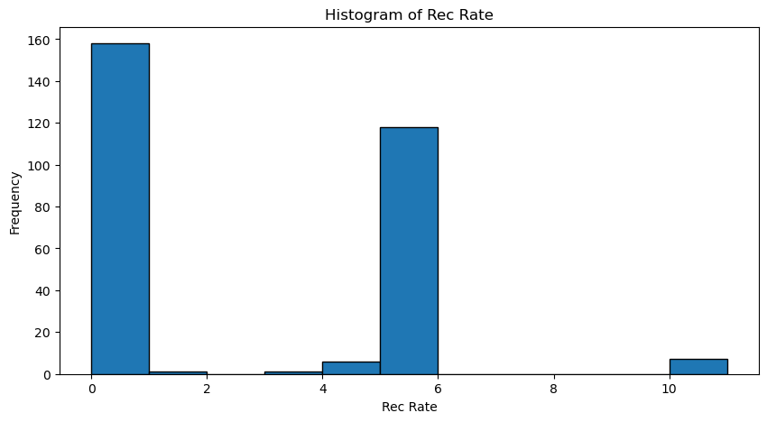
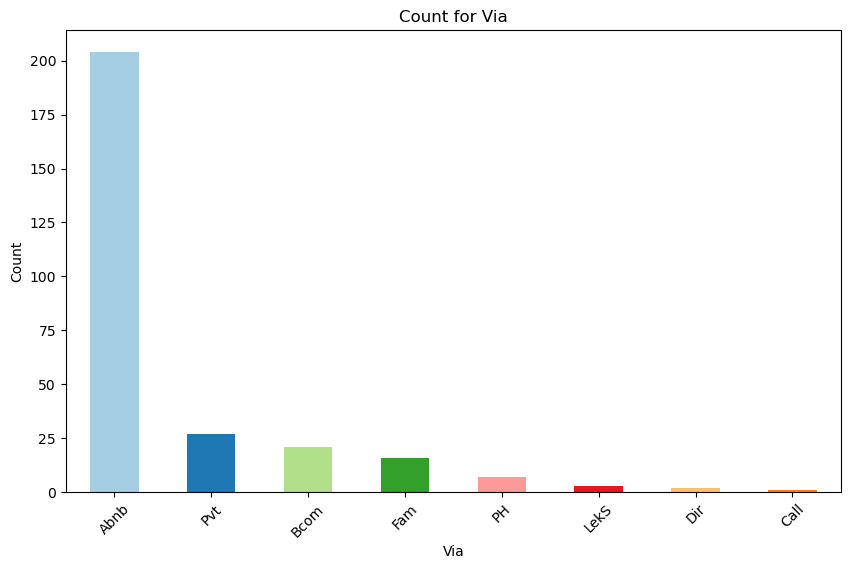
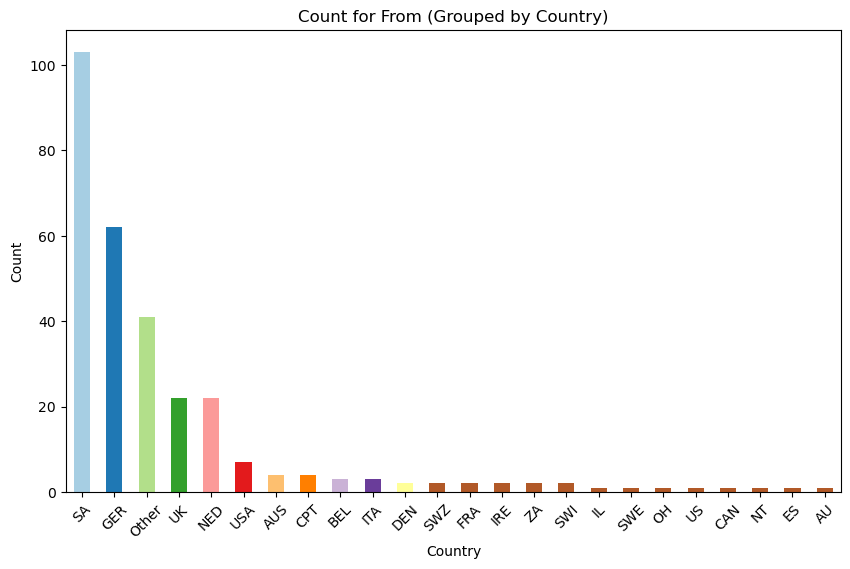
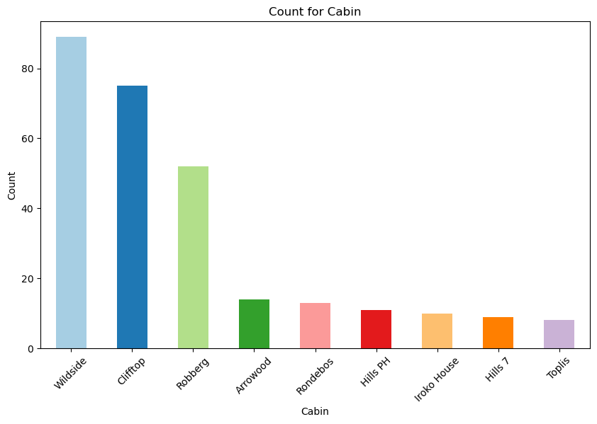
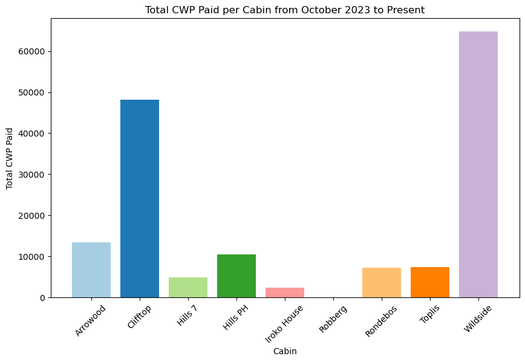
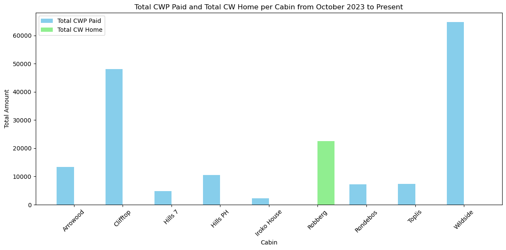
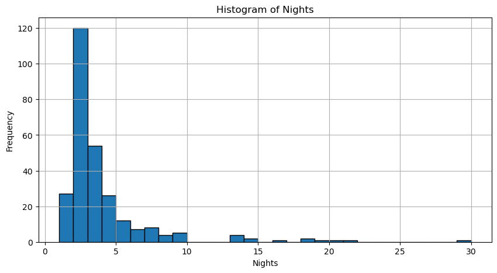
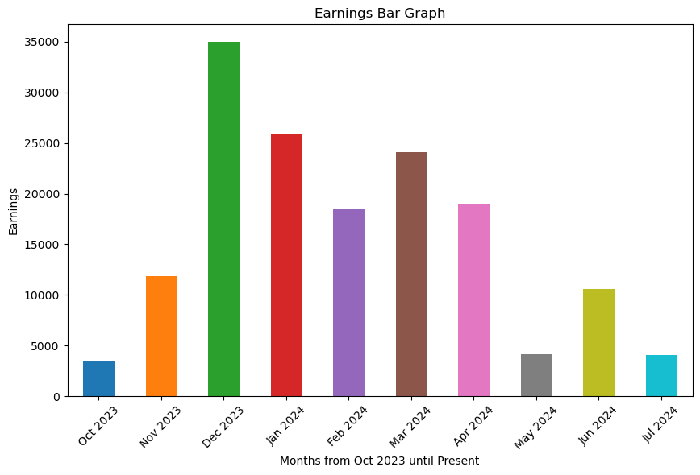
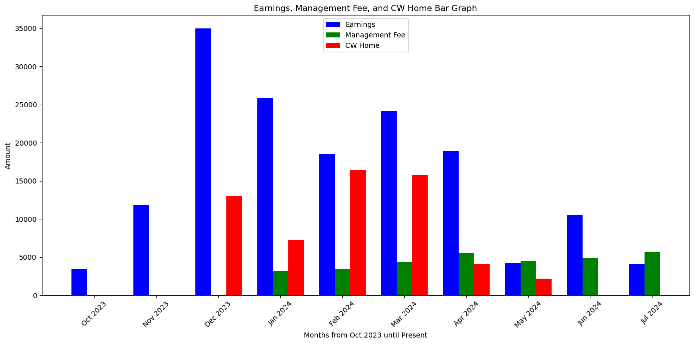
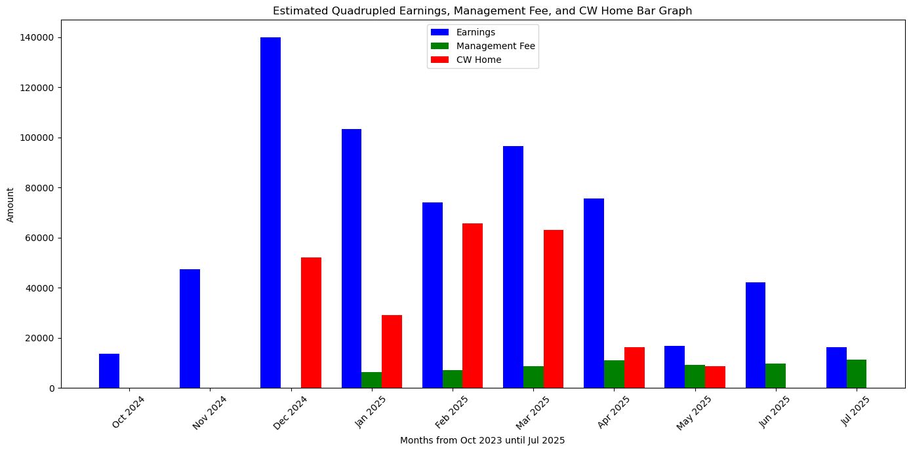

# Data Analysis: Airbnb Bookings

## Goals

**Clean up data:** Remove blanks, spaces, commas, unnecessary columns, and other extraneous details. Convert data to the correct formats (e.g., object, numeric, float). Remove the header and add a new header. All these steps are necessary for comprehensive data analysis.

**Data Analysis:** Utilize advanced data analysis techniques to uncover insights from complex datasets. By carefully examining and interpreting the data, I can identify trends, patterns, and anomalies that are crucial for making informed business decisions.

**Statistical Methods:** Apply statistical methods to analyze and summarize data. This includes performing descriptive statistics, hypothesis testing, and regression analysis to draw meaningful conclusions and support data-driven strategies.

**Predictive Modeling:** Leverage predictive modeling to forecast future trends and outcomes based on historical data. By building and validating models, I can provide estimates and predictions that guide strategic planning and decision-making.

**Data Visualization:** Create insightful graphs and visualizations to present data in a clear and understandable format. Visual tools such as bar charts, line graphs, and pivot tables help to effectively communicate findings and make complex data more accessible.

**Business Impact:** By combining these analytical techniques, I provide actionable insights that drive business growth and efficiency. My approach not only helps in understanding current performance but also in planning for future success.

### Reading the Data File

Opening the file in Python to work with it.

| Header   | In  | Dir | Let | Shed | Out | Rate | Rate | Name                 |
|----------|-----|-----|-----|------|-----|------|------|----------------------|
|          |     |     |     |      |     |      |      |                      |
| x        | x   | x   | x   | x    | 5   | 5    | Abnb | Athena Lysandrou     |
| x        | x   | x   | x   | x    | 5   | NaN  | Abnb | Lise Lotte Baert     |
| x        | x   | x   | x   | x    | 5   | 5    | Abnb | Zimkita Mbete        |
| x        | x   | x   | x   | x    | 5   | 5    | Abnb | Ebraheem Choonara    |

| From           | Nadia & Grant | Jeanne & Marc | Caz & Simon | CWP Paid | Date                 | CW Home | Earnings | Mang Fee | TOTAL | Earning Ea |
|----------------|---------------|---------------|-------------|----------|----------------------|---------|----------|----------|-------|------------|
|                | NaN           | NaN           | NaN         | NaN      |                      | NaN     | NaN      | NaN      | NaN   | NaN        |
| Sedgefield, SA | NaN           | NaN           | NaN         | 486.61   | 2023-11-20 00:00:00  | NaN     | NaN      | NaN      | NaN   | NaN        |
| Ghent, BEL     | NaN           | NaN           | NaN         | 486.6174 | 2023-11-20 00:00:00  | NaN     | NaN      | NaN      | NaN   | NaN        |
| Local, SA      | NaN           | NaN           | NaN         | 729.918  | 2023-11-20 00:00:00  | NaN     | NaN      | NaN      | NaN   | NaN        |
| SA             | NaN           | NaN           | NaN         | 486.612  | 2023-11-20 00:00:00  | NaN     | NaN      | NaN      | NaN   | NaN        |

### Clean Up Data

| Rec Rate | Via | Name                 | From             | Cabin    |
|----------|-----|----------------------|------------------|----------|
| 5        | Abnb | Athena Lysandrou     | Sedgefield, SA   | Clifftop |
| 0        | Abnb | Lise Lotte Baert     | Ghent, BEL       | Clifftop |
| 5        | Abnb | Zimkita Mbete        | Local, SA        | Wildside |
| 5        | Abnb | Ebraheem Choonara    | SA               | Clifftop |
| 5        | Abnb | Tobias Zolliker      | Dielsdorft, SWZ  | Clifftop |
| 5        | Abnb | Andrea Ticozzi       | Verona, ITA      | Wildside |
| 5        | Abnb | Jonas Lopatenko      | Werdohl, GER     | Wildside |
| 0        |     |                      |                  |          |
| 0        | Abnb | Darren Westwood      | Local, SA        | Wildside |
| 5        | Abnb | Hilton & Lindy Cameron | Port Eliz, SA  | Clifftop |

| Check in   | Check out  | Nights | CWP Paid | CW Home | Earnings | Mang Fee |
|------------|------------|--------|----------|---------|----------|----------|
| 2023-10-13 | 2023-10-15 | 2      | 487      | 0       | 0        | 0        |
| 2023-10-24 | 2023-10-26 | 2      | 487      | 0       | 0        | 0        |
| 2023-10-27 | 2023-10-30 | 3      | 730      | 0       | 0        | 0        |
| 2023-10-27 | 2023-10-29 | 2      | 487      | 0       | 0        | 0        |
| 2023-10-30 | 2023-11-01 | 2      | 487      | 0       | 0        | 0        |
| 2023-10-30 | 1931-10-31 | 1      | 243      | 0       | 0        | 0        |
| 2023-10-31 | 2023-11-02 | 2      | 487      | 0       | 0        | 0        |
|            |            | 0      | 3406     | 0       | 3406     | 0        |
| 2023-11-02 | 2023-11-05 | 3      | 730      | 0       | 0        | 0        |
| 2023-11-03 | 2023-11-05 | 2      | 487      | 0       | 0        | 0        |

### Analysing Data (including Statistics, Probability and Visual Grapahs)

#### Rec Rate (Reommended Rate)

##### From Oct 2023 to Jul 2024

According to this graph, just under 160 people did not provide a rating, accounting for 54% of respondents. About 40% gave a 5-star rating, 2.41% rated 10 stars, 2.06% rated 4 stars, and 0.34% rated between 3 to 1 stars. The average rating is 4.9, with 5 stars being the most common rating among those who participated. There were 291 ratings in total, including those who did vote. This indicates that you are doing an excellent job in meeting clients' needs, wants, and requirements. Maintaining this standard should help keep ratings high. Note that the 10-star ratings are from Booking.com, which corresponds to a 5-star rating on Airbnb, while all other ratings are from Airbnb.

    
### Summary Statistics

- **Mean**: 4.9
- **Mode**: 5
- **Count**: 291

### Probability Distribution (%)

| **Rating** | **Proportion (%)** |
|------------|--------------------|
| 0          | 54.30              |
| 1          | 0.34               |
| 3          | 0.34               |
| 4          | 2.06               |
| 5          | 40.55              |
| 10         | 2.41               |

#### Count for VIA (Airbnb, Booking.com, etc...)

##### From Oct 2023 to Jul 2024

Looking at the bar graph below, the majority of bookings came from Airbnb, accounting for 72.60%. Other sources were significantly weaker in comparison. However, considering that you started the business in October 2023, initially using only Airbnb, this platform has a natural advantage since you began using others later. Nonetheless, Airbnb reaches a large audience and is the most suitable for this type of business. Please see below for the counts (number of bookings) and the percentage of bookings by website based on their count.

### Count for 'Via'

| **Via** | **Count** |
|---------|-----------|
| Abnb    | 204       |
| Pvt     | 27        |
| Bcom    | 21        |
| Fam     | 16        |
| PH      | 7         |
| LekS    | 3         |
| Dir     | 2         |
| Call    | 1         |

### Probability Distribution (%)

| **Via** | **Proportion (%)** |
|---------|--------------------|
| Abnb    | 72.60              |
| Pvt     | 9.61               |
| Bcom    | 7.47               |
| Fam     | 5.69               |
| PH      | 2.49               |
| LekS    | 1.07               |
| Dir     | 0.71               |
| Call    | 0.36               |

#### Count for From (Country)

##### From Oct 2023 to Jul 2024

This graph shows the distribution of all bookings, with South Africa leading with over 100 bookings, which is expected since the properties are located there. What's interesting is that Germany is the second highest, suggesting that Germans are frequent travelers and a key tourist demographic for South Africa, especially Plettenberg Bay. With this insight, you might consider incorporating German language options in your listings or adding German cultural elements to enhance appeal for German visitors. 'Other' is in third place, but it's difficult to draw specific conclusions from that category. The remaining countries have relatively small numbers, except for the UK and the Netherlands, which suggests that English-speaking countries might feel most comfortable traveling to Plettenberg Bay. Comparing bookings by country helps in understanding your audience better.
    

#### Count for Cabin (all places)

##### From Oct 2023 to Jul 2024

Each place’s count (I named the heading 'Cabin' in the data for clarity and consistency). Considering the business started in October 2023 with Wildside and Clifftop (the two cabins), it's understandable that these locations have an advantageous starting point in terms of bookings, as the other places were added later, though not much later. Analyzing this data, it can be deduced that smaller rooms and cabins are more valuable and attractive than larger houses. According to this data, small bachelor rooms like Wildside, Clifftop, and Robberg are in high demand. This suggests that guests prefer these options due to their lower cost, less maintenance required, and suitability for shorter stays. The other places have relatively weaker performance, likely due to being larger apartments or houses. However, without precise time stamps for each place's start date, it's difficult to make a full comparison of the statistics and results. Still, valuable insights can be drawn from this deduction.

#### Total Income Generated per Cabin

##### From Oct 2023 to Jul 2024

According to this data, smaller rooms and bachelor-type cabins are the most lucrative. Although there's not enough data for a full comparison, this is still valuable information. The data for Robberg is shown in the next graph, as I was unable to include it in the current one, so a new graph was created below.

#### Histogram of Nights

##### From Oct 2023 to Jul 2024

Considering that Wildside, Clifftop, and Robberg were the most booked with a minimum stay of 2 nights (with Robberg also allowing 1-night stays), the data suggests that while people had the option to book longer stays, the market prefers shorter stays. The graph shows a peak of 120 nights booked at 2 nights, gradually tapering off to 20 nights, forming a right-skewed distribution. This indicates that guests are more likely to book 2 nights and then possibly extend their stay rather than opting for shorter stays, which are rare and less manageable. Therefore, for future bookings, the lower you can set the minimum night stay, the more likely people will book, leading to increased revenue—provided it’s worthwhile in terms of maintenance and staffing costs.

#### Mean, Max & Min 'CW Home'

##### From Oct 2023 to Jul 2024

The 'CW Home' column reflects the earnings for Robberg in the 'Cabin' category. The Robberg Room averaged R5,417 per month, with a maximum monthly income of R16,394 and a minimum of R1,305. Considering Robberg only started operating from December 2023 to May 2024 due to renovations, this is impressive. The high income is also attributed to the client gaining full access to revenue, as it is a small bachelor room in their guest house, without the 20% fee deducted as with other properties like Wildside. Despite these factors, it's evident that this is a highly lucrative earning system with minimal effort. An average of R5,417 per month is a solid starting point, especially with your future plans for three rooms starting soon. This could potentially quadruple your income, with three times the earning potential. This is a brilliant opportunity for upward income growth.

### Earnings Summary

- **Average Earning**: 5,417.54
- **Max Earning**: 16,394
- **Min Earning**: 1,305.68

#### Earnings Bar Graph

##### From Oct 2023 to Jul 2024

Based on the data shown in the bar graph, the most lucrative months are in-season (November to April), which is expected as tourism peaks during Christmas and Plettenberg Bay is a popular vacation destination. People typically take time off work at the end of the year, driving demand. The statistics below the graph show that the maximum earning month was December, while the minimum was October—understandably, as the business just started then. The average earnings were around R15,625. Considering all the stats and the graph, it's clear that demand increases in-season and drops off out-of-season. You could adjust your pricing strategy accordingly by increasing prices during high-demand periods and lowering them during low-demand times. Given that December is such a high-earning month, you might consider raising prices even more during that time.
    

### Earnings Summary

- **Average Earning**: 15,625.76
- **Max Earning**: 34,962.36
- **Min Earning**: 3,406.31

#### Earnings Bar Graph (Including Mang Fee & CW Home)

##### From Oct 2023 to Jul 2024

Comparing the earnings side by side provides valuable insight into the sources of revenue and how they relate to each earnings performance. It is evident that managing your own property and renting it out short-term is significantly more lucrative compared to managing or renting out other people’s homes for a 20% fee. Additionally, the growth in management fees is noticeable, which can be attributed to the increase in the number of properties under management.

### Estimation for Future Business Impact

#### Estimated Quadrupled Earnings

##### From Oct 2024 to Jul 2025

This future estimated graph shows the likely earnings for Calm Waters Plett from October 2024 to July 2025. With more properties available for rent and the benefit of time to secure optimal prices, there is a significant boost in expected income. CW Home will also feature three rooms at higher rates than before, providing a substantial increase in revenue. The management fee has been increased only twofold, as it is still possible to manage more properties; however, the high demand during the season does not significantly boost earnings. According to the graph, I have multiplied the estimates by four (except for the management fee) to provide a good estimate of potential earnings. In December, the most lucrative month, you could earn around R140,000 for CW Plett and approximately R55,000 for CW Home. However, considering you only started at the end of December last year, a more realistic estimate for CW Home would be around R80,000. Overall, this represents a significant progressive income increase from the start until now. If this trend continues, next year could see even higher earnings, provided CW Plett can manage additional properties.

